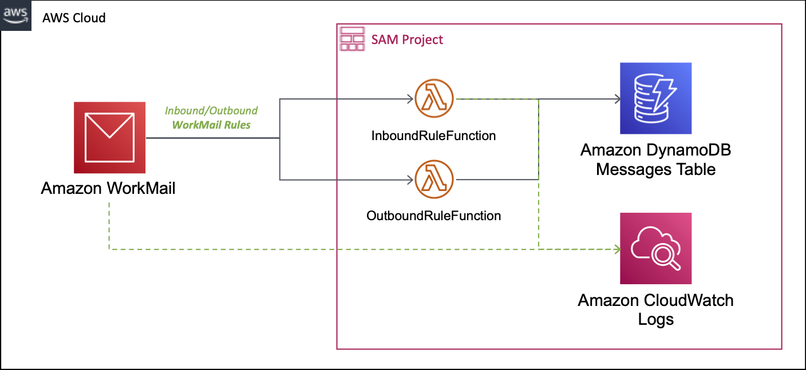

# Lambda functions for WorkMail Rules (Inbound/Outbound) with SAM

This project contains source code and supporting files for a serverless application that you can deploy with the SAM CLI.
The Lambda functions including in this project allows you to send and receive emails only **to/from** the Workmail domain specified.



## Prerequisites

- Work in your local or [AWS Cloud9](https://aws.amazon.com/cloud9/) environment
- Clone this Github repository
- WorkMail Organization configured - [Creating an organization](https://docs.aws.amazon.com/workmail/latest/adminguide/add_new_organization.html)

## Deploy the application

The Serverless Application Model Command Line Interface (SAM CLI) is an extension of the AWS CLI that adds functionality for building and testing Lambda applications. It uses Docker to run your functions in an Amazon Linux environment that matches Lambda. It can also emulate your application's build environment and API.

To use the SAM CLI, you need the following tools.

* SAM CLI - [Install the SAM CLI](https://docs.aws.amazon.com/serverless-application-model/latest/developerguide/serverless-sam-cli-install.html)
* [Python 3 installed](https://www.python.org/downloads/)
* Docker - [Install Docker community edition](https://hub.docker.com/search/?type=edition&offering=community)


To build and deploy your application for the first time, run the following in your shell:

```bash
sam build --use-container
sam deploy --guided
```

The first command will build the source of your application. The second command will package and deploy your application to AWS, with a series of prompts:

* **Stack Name**: The name of the stack to deploy to CloudFormation. This should be unique to your account and region, and a good starting point would be something matching your project name.
* **AWS Region**: The AWS region you want to deploy your app to.
* **Parameter Domain**: The domain to use for your Workmail organization.
* **Confirm changes before deploy**: If set to yes, any change sets will be shown to you before execution for manual review. If set to no, the AWS SAM CLI will automatically deploy application changes.
* **Allow SAM CLI IAM role creation**: Many AWS SAM templates, including this example, create AWS IAM roles required for the AWS Lambda function(s) included to access AWS services. By default, these are scoped down to minimum required permissions. To deploy an AWS CloudFormation stack which creates or modified IAM roles, the `CAPABILITY_IAM` value for `capabilities` must be provided. If permission isn't provided through this prompt, to deploy this example you must explicitly pass `--capabilities CAPABILITY_IAM` to the `sam deploy` command.
* **Save arguments to samconfig.toml**: If set to yes, your choices will be saved to a configuration file inside the project, so that in the future you can just re-run `sam deploy` without parameters to deploy changes to your application.

Example of configuration:

```bash
        Setting default arguments for 'sam deploy'
        =========================================
        Stack Name [sam-app]: sam-workmail-lambda-rules
        AWS Region [us-east-1]: us-east-1
        Parameter Domain []: mail.domain.com
        #Shows you resources changes to be deployed and require a 'Y' to initiate deploy
        Confirm changes before deploy [y/N]: y
        #SAM needs permission to be able to create roles to connect to the resources in your template
        Allow SAM CLI IAM role creation [Y/n]: y
        Save arguments to configuration file [Y/n]: y
        SAM configuration file [samconfig.toml]: samconfig.toml
        SAM configuration environment [default]: 
```

After the deployment is finished, you will find **2 Lambda functions** to use in the output values displayed.

## Configure WorkMail Rules (Inbound/Outbound)

[Configuring AWS Lambda for Amazon WorkMail](https://docs.aws.amazon.com/workmail/latest/adminguide/lambda.html) using the functions created with SAM.